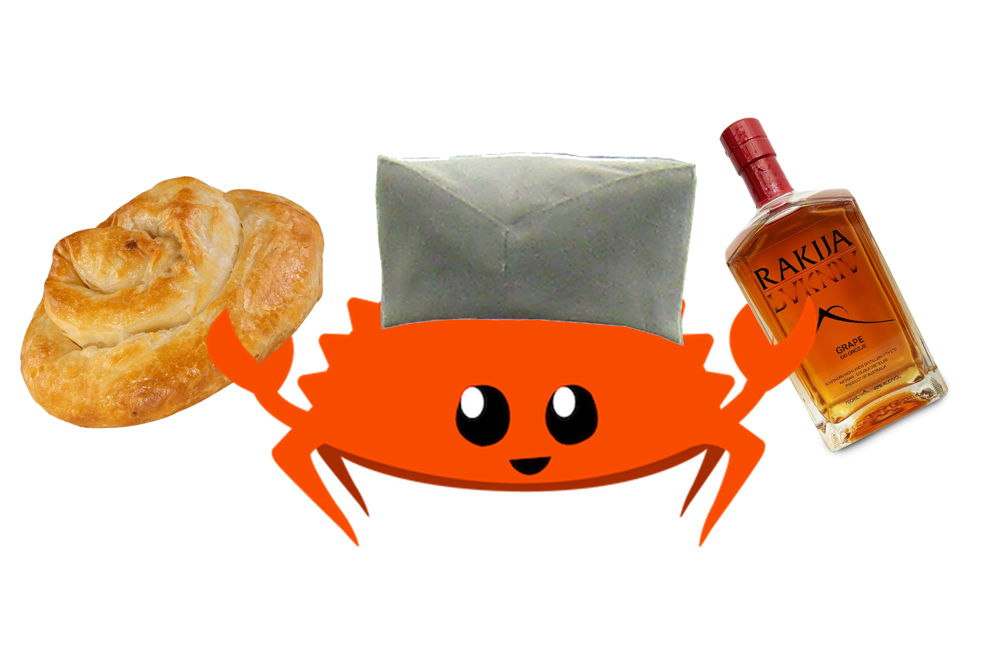

# Rđa (Рђа)

_Write Rust in Serbian - Both Cyrillic (Ћирилица) & Latin (Latinica)!_

<!--  -->




Are you **bored to death** of writing Rust programs in English? Do you like to say "sranje", "jebi ga" or "у три лепе шаргарепе" a lot? Would you like to try something different? Would you want to bring some Serbian touch to your programs?

**Rđa** (Serbian for Rust) is here to save your day, as it allows you to write Rust programs in Serbian, using Serbian keywords, Serbian function names, and Serbian idioms.

You don't feel at ease using only Serbian words? Don't worry! Rđa was inspired by the [`unirust`](https://github.com/charyan/unirust) project and is therefore fully compatible with English Rust, so you can mix both at your convenience. But why stop there? Its also planned for it to be compatible with the rest of the unirust project!

## Пример / Example

```rust
use rust_dk::rust;

rust! {
    користи std::io;

    struktura Igrač {
        ime: Низ,
        čaše: u32,
        pijanost: u32,
    }

    импл Igrač {
        фк novo(ime: Niz) -> Sam {
            Igrač { ime, čaše: 0, pijanost: 0 }
        }

        фк pij(&променљиво сам) {
            sam.čaše += 1;
            пишиЛинију!("Живели! Čaša broj: {}", sam.čaše);
        }
    }

    fk главно() {
        пишиЛинију!("Dobrodošao u kafanu!");

        neka променљиво igrač = Igrač::novo(Niz::iz("Миле"));
        igrač.pij();

        pišiLiniju!("Doviđenja!");
    }
}
```

## Инсталација / Installation

Add to your `Cargo.toml`:

```toml
[dependencies]
rust-dk = { path = "rust_proc_macro" }
```

## Примери / Examples

Run the Rakija Simulator game:

```bash
cargo run --example rakija
```

Other examples:
```bash
cargo run --example test_cyrillic  # Cyrillic only
cargo run --example test_latin      # Latin only
```

## Зашто? / Why?

* Зашто не?

## Лиценца / License

[WTFPL](http://www.wtfpl.net/)

---
## Other languages

- Dutch: [roest](https://github.com/jeroenhd/roest)
- German: [rost](https://github.com/michidk/rost)
- Polish: [rdza](https://github.com/phaux/rdza)
- Italian: [ruggine](https://github.com/DamianX/ruggine)
- Russian: [Ржавый](https://github.com/Sanceilaks/rzhavchina)
- Esperanto: [rustteksto](https://github.com/dscottboggs/rustteksto)
- Toki Pona: [jaki kiwen](https://github.com/jgcodes2020/jaki-kiwen)
- Hindi: [zung](https://github.com/rishit-khandelwal/zung)
- Hungarian: [rozsda](https://github.com/jozsefsallai/rozsda)
- Chinese: [xiu (锈)](https://github.com/lucifer1004/xiu)
- Spanish: [rustico](https://github.com/UltiRequiem/rustico)
- Korean: [Nok (녹)](https://github.com/Alfex4936/nok)
- Finnish: [ruoste](https://github.com/vkoskiv/ruoste)
- Arabic: [sada](https://github.com/LAYGATOR/sada)
- Turkish: [pas](https://github.com/ekimb/pas)
- Vietnamese: [gỉ](https://github.com/Huy-Ngo/gir)
- Japanese: [sabi (錆)](https://github.com/yuk1ty/sabi)
- Danish: [rust?](https://github.com/LunaTheFoxgirl/rust-dk)
- Marathi: [gan̄ja](https://github.com/pranavgade20/ganja)
- Romanian: [rugină](https://github.com/aionescu/rugina)
- Czech: [rez](https://github.com/radekvit/rez)
- Ukrainian: [irzha](https://github.com/brokeyourbike/irzha)
- Bulgarian: [ryzhda](https://github.com/gavadinov/ryzhda)
- Slovak: [hrdza](https://github.com/TheMessik/hrdza)
- Slovene: [rja](https://github.com/sstanovnik/rja)
- Catalan: [rovell](https://github.com/gborobio73/rovell)
- Corsican: [rughjina](https://github.com/aldebaranzbradaradjan/rughjina)
- Indonesian: [karat](https://github.com/annurdien/karat)
- Greek: [skouriasmeno](https://github.com/devlocalhost/skouriasmeno)
- Thai: [sanim (สนิม)](https://github.com/korewaChino/sanim)
- Swiss: [roeschti](https://github.com/Georg-code/roeschti)
- Swedish: [rost](https://github.com/vojd/rost/)
- Croatian: [hrđa](https://github.com/njelich/hrdja)
- Persian: [zangar (زنگار)](https://github.com/ui-ce/zangar)
- Malagasy: [arafesina](https://github.com/luckasRanarison/arafesina)
- Latin: [ferrugo](https://github.com/pianoman911/ferrugo)
- Norwegian: [korrosjon](https://github.com/datagutt/korrosjon)
- Estonian: [rooste](https://github.com/hanshs/rooste)
- Kannada: [tukku (ತುಕ್ಕು)](https://github.com/sanathNU/tukku.git)
- Nepali: [khiya (खिया)](https://github.com/sudanchapagain/khiya.git)
- Sanskrit: [jangam](https://github.com/ishantanu/jangam.git)
- Scottish Gaelic: [meirg](https://github.com/KSPAtlas/meirg)
- All of the above: [unirust](https://github.com/charyan/unirust)

